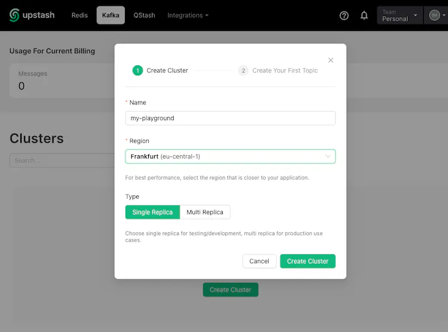
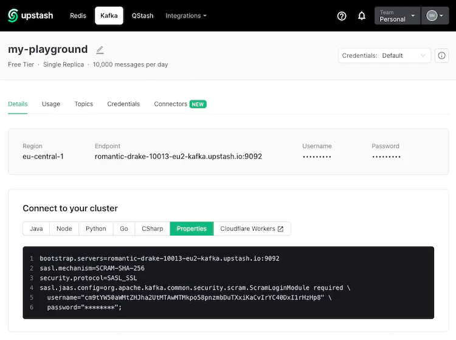

### Instructions per [Udemy's Kafka course by Conduktor](https://www.udemy.com/course/apache-kafka/)

1. Install Apache Kafka on Mac (or other OS), [here's some useful docs](https://www.conduktor.io/kafka/how-to-install-apache-kafka-on-mac/)

2. Create a free Kafka cluster on Upstash 
   - Visit Upstash and [Create Cluster](https://upstash.com/)
   - [Register an account](https://console.upstash.com/kafka) and verify your via email.
   - When it's done, it will ask you to create a topic. Skip this step as we'll create topics later in the CLI



   - Go to the Details of your fresh new Kafka cluster, and copy the content of the Properties tab. It should be a URL like: "https://console.upstash.com/kafka/XXX"


   
   - Paste them using your text editor into a file called: playground.config.

3. Test your Kafka bootstrap server: Here is an example of how your commands will look like:
```
# Starting zookeeper 
/opt/homebrew/bin/zookeeper-server-start /opt/homebrew/etc/zookeeper/zoo.cfg 

# Starting kafka
# Open another Terminal window and run the following command from the root of Apache Kafka.
/opt/homebrew/bin/kafka-server-start /opt/homebrew/etc/kafka/server.properties

# Keep both terminal windows opened, otherwise you will shut down Kafka or Zookeeper.

# Listing topics 
kafka-topics.sh --command-config playground.config --bootstrap-server xxx.upstash.io:9092 --list
```
